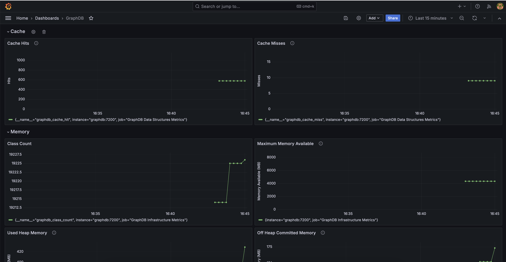

# GraphDB Grafana Dashboard

Grafana dashboard for GraphDB

## Background

This repository contains a lightweight Grafana dashboard for GraphDB (Free) that scrapes data from Prometheus, which is in turn scraping data from GraphDB’s metrics endpoint (you need Prometheus for this).

## Dashboard

The dashboard exposes *most* of the metrics that GraphDB provides. This is limited to system level metrics such as space constraints, memory, and heap usage.

- graphdb_cache_hit
- graphdb_cache_miss
- graphdb_class_count
- graphdb_heap_max_mem
- graphdb_heap_used_mem
- graphdb_nonheap_committed_mem
- graphdb_heap_committed_mem
- graphdb_nonheap_used_mem
- graphdb_cpu_load
- graphdb_open_file_descriptors
- graphdb_logs_dir_free
- graphdb_logs_dir_used
- graphdb_data_dir_used
- graphdb_data_dir_free
- graphdb_work_dir_free
- graphdb_work_dir_used

